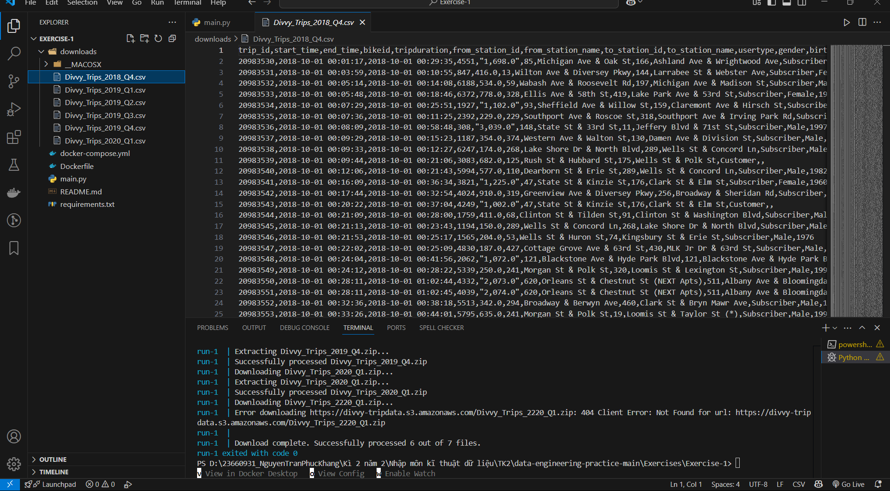
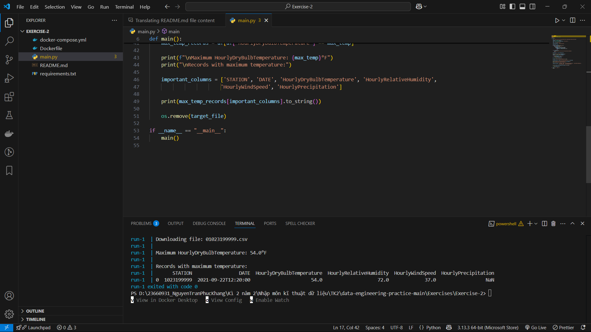
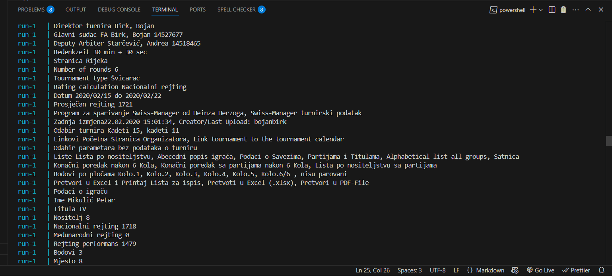
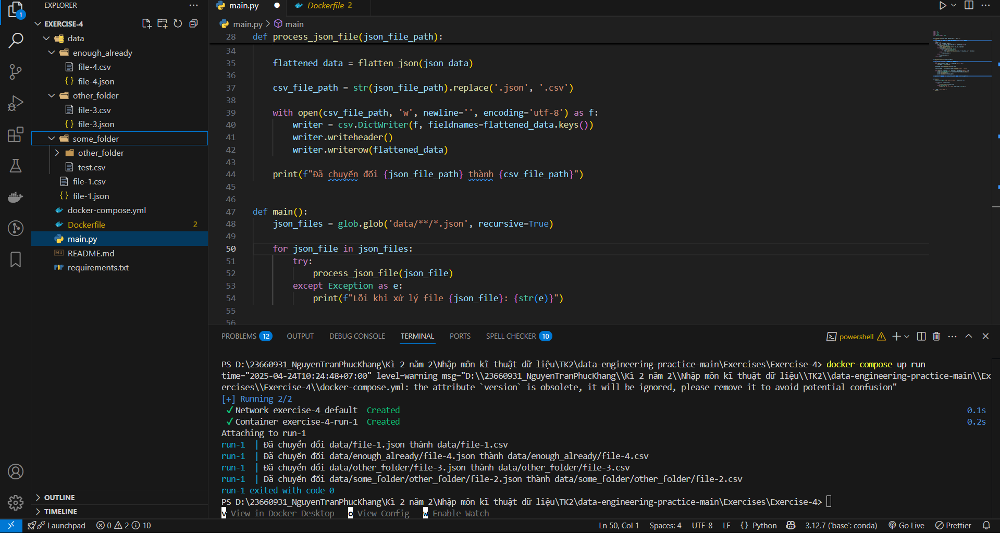
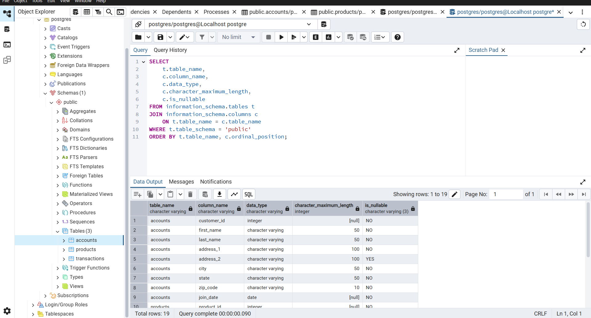
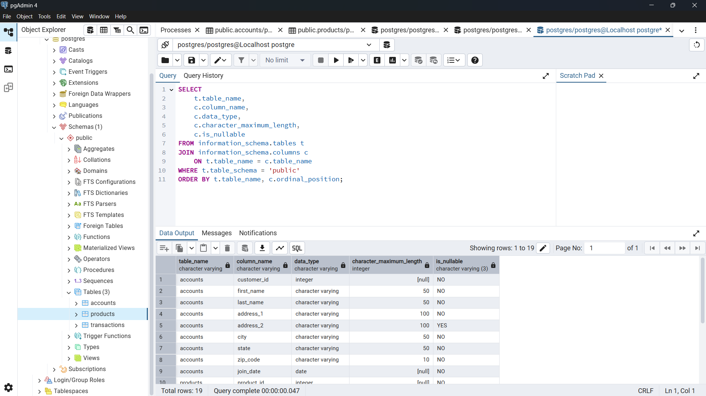
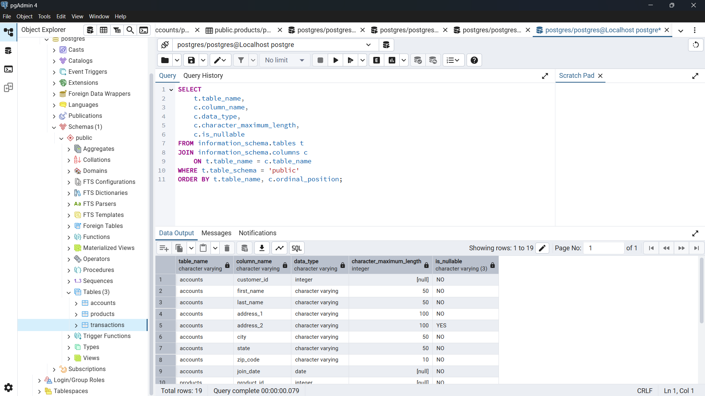

EXERCISE 1
1.Tạo thư mục downloads nếu nó chưa tồn tại.
2.Tải xuống các tệp từng cái một.
3.Tách tên tệp từ đường dẫn tải xuống để tệp giữ nguyên tên gốc của nó.
4.Mỗi tệp là một tệp zip, giải nén tệp csv từ tệp zip và xóa tệp zip.

EXERCISE 2
1.Thử web scrape/lấy nội dung của https://www.ncei.noaa.gov/data/local-climatological-data/access/2021/
2.Phân tích cấu trúc của nó, xác định cách tìm file tương ứng với 2024-01-19 10:27 bằng Python.
3.Xây dựng URL cần thiết để tải file này, và ghi file vào máy local.
4.Mở file bằng Pandas và tìm các bản ghi có HourlyDryBulbTemperature cao nhất.
5.In kết quả ra stdout/command line/terminal.

EXERCISE 3
1.Sử dụng boto3 để tải file gz từ S3 bucket "commoncrawl"
2.Đọc và giải nén file trong bộ nhớ
3.Lấy URI từ dòng đầu tiên
4.Dùng boto3 để tải file thứ hai từ URI đó
5.In từng dòng của file thứ hai ra màn hình
1.Sử dụng boto3 để tải file gz từ S3 bucket "commoncrawl"
2.Đọc và giải nén file trong bộ nhớ
3.Lấy URI từ dòng đầu tiên
4.Dùng boto3 để tải file thứ hai từ URI đó
5.In từng dòng của file thứ hai ra màn hình

EXERCISE 4
1.Tìm tất cả các file JSON trong thư mục data
2.Đọc các file JSON
3.Làm phẳng cấu trúc JSON
4.Chuyển đổi thành CSV

EXERCISE 5

